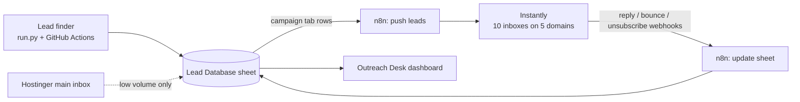

# Quixify cold email infrastructure

Target: 1,000+ cold emails a week without putting quixifymedia.com at risk.

## How it fits together

- **The sheet is the source of truth.** Every campaign has a row in `Campaigns`, a leads tab
  (same columns as `outreach`: research, subject, Day 1, Day 3, Day 7, Day 14, Status, Step,
  Day 1 sent, Last sent, Reply/notes, Test group) and an offer tab holding the follow-up templates.
- **Instantly sends.** It rotates the 10 inboxes, warms them up, spaces the sends and spots replies.
- **n8n keeps them in sync.** One workflow adds new sheet rows to the matching Instantly campaign
  with the personalised copy as custom variables. A second receives Instantly's webhooks and
  writes Status / Reply/notes back to the sheet.
- **The dashboard reads the sheet** (Outreach Desk artifact), so it shows the same numbers
  whichever tool did the sending.
- **quixifymedia.com never sends cold email at volume.** It stays on Hostinger for replies,
  client work and the small boutique campaign.

## Sizing for 1,000+ a week

| | |
|---|---|
| Weekly emails | 1,000 to 1,500 (about 250 to 375 new prospects a week at 4 emails each) |
| Per weekday | 200 to 300 |
| Inboxes | 10 (2 per domain), 30 cold emails a day each = 300 a day |
| Domains | 5 lookalike .com domains, each redirecting to quixifymedia.com |
| Providers | 3 domains on Google Workspace, 2 on Microsoft 365 (mixing helps inbox placement) |
| Warm-up | 3 weeks before the first cold email, and keep warm-up on afterwards |

Scale past 1,500 a week by adding domains and inboxes in the same 2-per-domain pattern, not by
raising the per-inbox limit.

Domains checked as available on 2026-10-09 (about $16 a year each; availability can change):
`getquixify.com`, `tryquixify.com`, `quixifyhq.com`, `meetquixify.com`, `usequixify.com`.
Buy them at a normal registrar (Cloudflare, Porkbun, Namecheap) or through Instantly's own
domain and inbox setup, so the DNS records are easy to add.

## Rough monthly cost (check current prices before buying)

| Item | Approx. |
|---|---|
| Instantly, a plan that allows ~1,500 uploaded leads and ~6,000 emails a month or more | $40 to $100 |
| 10 inboxes (Google Workspace / Microsoft 365, about $6 to $7 each) | $60 to $70 |
| 5 domains (about $16 a year each) | about $7 |
| Email verification for new lists (e.g. Instantly's verifier or MillionVerifier) | $10 to $30 |
| n8n Cloud (already have it) | existing |

## Setup steps

Zunaira (needs payment or logins):
1. Buy the 5 domains. Point each one's website to quixifymedia.com (a redirect).
2. Create the 10 inboxes (names in the `Inboxes` tab). Add a profile photo and signature to each.
3. Add SPF, DKIM and DMARC for each domain (the inbox provider shows the exact records). Mark
   each one `OK` in the `Inboxes` tab once it verifies.
4. Sign up for Instantly, connect all 10 inboxes, turn warm-up on, and write today's date in
   `Warm-up started` for each.
5. In n8n, approve installing the Instantly community node, and add an Instantly API key as a
   credential (typed into n8n, never into chat).

Claude (once the above exists):
6. Install the Instantly node, build the two sync workflows (sheet to Instantly, webhooks back
   to sheet), and create one Instantly campaign per sheet campaign using the custom variables
   `subject`, `day1`, `day3`, `day7`, `day14`.
7. Test with one internal address, then flip the campaign's Status to `Live`.

## Rules that keep the domains healthy

- Verify every new list before it goes into Instantly; drop invalid and catch-all-risky emails.
- Keep bounces under 2% and spam complaints near zero. Pause a campaign that crosses either.
- Plain text, no images or attachments, one link at most (the portfolio link only in Day 3).
- Every email keeps the opt-out line; honour every "no" and unsubscribe within a day.
- Never connect quixifymedia.com to the cold sending tool.
